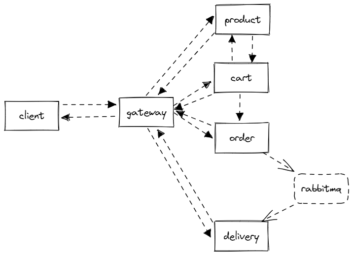
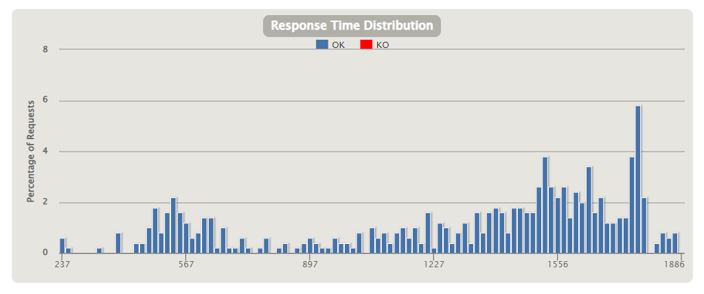
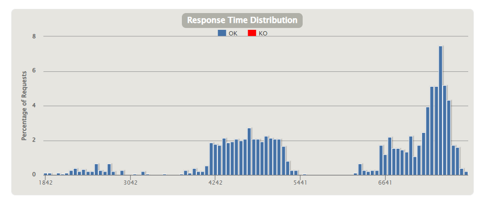

> This is a pure mirror of aw09
# aw09

Services:
1. Gateway
    * infer routes automatically with Nacos, Like, `GET localhost:10300/carts/api/all`
2. Cart
    * Get/Update/Checkout
3. Product
    * Batch, non-reactive
    * Search/Get
4. Order
    * CreateOrder, push message to rabbitmq
5. Delivery
    * message consumer, createDelivery
    * Get

Third-party services (`docker-compose.yml`):
1. Nacos, service registery
2. Mongodb
3. Rabbitmq

Reactive: 
1. Responsive, using WebFlux stack (except product-batch).
2. Resilient, backpressure.
3. Elastic, easy to scale out with containerization.
4. Message driven, use REST & Rabbitmq for service communication.

## 压力测试

可以发现（尤其1500并发访问测试），响应式架构的被压机制让服务在大流量下不会过载。

500并发访问：

1500并发访问：

> Thanks for mates' great work, I refer (the choice of arch) to some of those.